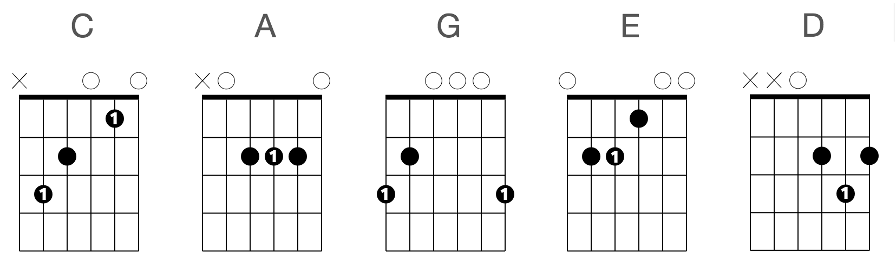
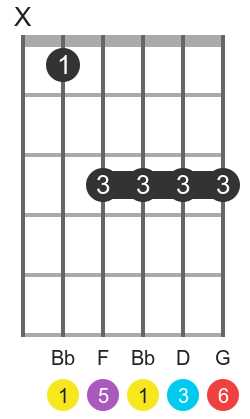

# Sistema CAGED

El sistema CAGED es un método que permite encontrar 5 posiciones diferentes para cualquier acorde. Para ello, se hace uso de los 5 acordes básicos (C, A, G, E y D) en su primera posición:

    

Se basa en trasponer estos acordes y utilizar su versión con cejilla. La cantidad de trastes que se desplaza dependerá del acorde que se quiera tocar. Las formas con cejilla son las siguientes:

    

Nótese que el acorde de La (A) usaría una cejilla en el tercer traste. Lo mismo ocurre con G, que la llevaría en el quinto, E en el octavo y D en el décimo. En ningún caso se deja la cuerda al aire.

## Caso 1

El primer caso de uso del sistema CAGED se da cuando se quiere buscar un acorde en una parte concreta del mástil. 

Supongamos que se quiere buscar Si bemol (Bm). Los pasos a seguir serían:

1. Localizar la nota Bm en una de las cuerdas 4, 5 o 6. Por ejemplo se podría tomar el primer traste de la quinta cuerda. 
2. Ahora se debe encontrar un acorde del sistema CAGED que sirva para formar el acorde de Bm. Para ello se busca aquel cuya tónica coincida con la del Bm, pero traspuesta X número de trastes. El acorde A tiene su tónica en esta cuerda al aire, así que se desplaza un traste, poniendo una cejilla en el primer traste, y la posición de A.

    

Otra opción sería busca el Bm en la sexta cuerda, que se encuentra en el traste 6. En este caso se pueden utilizar dos acordes del sistema CAGED: E y G, que ambos tienen su tónica en la sexta cuerda. Se desplaza cada uno de ellos (junto con su cejilla) hasta que la tónica coincida con la del Bm. Las posiciones resultantes serían. En el caso del E, la tónica coincidirá con la cejilla y en el caso del G la tónica será la del dedo de la sexta cuerda.

## Caso 2

Otro caso de uso del sistema CAGED es el de encontrar todos las formas posibles de colocar un mismo acorde. Esta forma es útil a la hora de combinar escalas a lo largo del mástil. 

Lo que se hace es partir de un acorde básico o uno generado con el [primer caso de uso](#caso-1) y desplazarte tantos trastes (en ambas direcciones) como indique el sistema CAGED:

    

