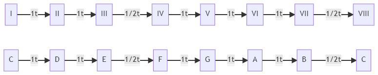
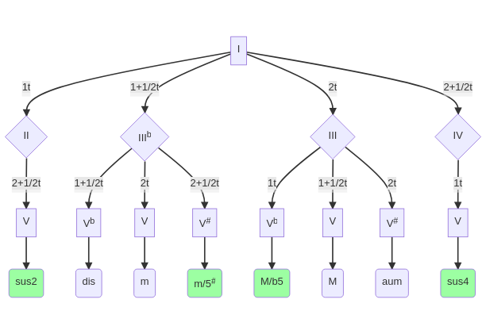

# Formación de acordes

Al final de la página se explica un ejemplo para cada una de las secciones.

## Recordatorio sobre los grados e intervalos

Un intervalo es la distancia que hay entre dos notas y es la unidad básica de la armonía. Entre 8 grados hay 6 intervalos, distribuidos de la siguiente manera:

    

Se muestra el caso concreto de la escala de Do, pero se aplica a cualquiera.

## Formación de los acordes más comunes

Siguiendo el siguiente esquema se puede formar cualquier acorde de los que se muestran en la parte inferior. En verde se señalan los acordes modernos frente a los de la teoría clásica. Siempre se parte del primer grado. A continuación se elige uno de las 4 opciones (II, IIIb, III o IV) y finalmente una de los grados de la última fila.

Se ha señalado también el número de intervalos que hay entre cada uno de los grados, siendo `t` equivalente a un tono.

    

## Acordes séptima

| Nombre del acorde | Acrónimo | Descripción                                           | Grados                                             |
|-------------------|----------|-------------------------------------------------------|----------------------------------------------------|
| Sétima mayor      | Maj7     | se añade un grado VII al acorde **mayor**             | I, III, V, VII                                     |
| Sétima menor      | m7       | se añade un grado VIIb al acorde **menor** | I, IIIb, V, VIIb             |
| Séptima dominante | 7 ó Dom7 | se añade un grado VIIb al acorde **mayor** | I, III, V, VIIb                         |
| Semidisminuido    | m7b5     | se añade un grado Vb al **m7**             | I, IIIb, Vb, VIIb |

## Otros acordes

Siempre es posible completar los acordes con un nuevo grado. Por ejemplo, se podría formar un _Re menor con sexta_ (Dm6), _Do novena_ (C9), etcétera. La forma más sencilla de formar estos acordes es partir del acorde original y buscar la cuerda con el grado más cercano. A continuación, disminuir esa nota en tantos trastes como sea necesario. Esta es la forma más rápida de alcanzar el grado deseado.

Los [acordes séptima](#acordes-séptima) también se pueden conseguir mediante este método.

## Ejemplos

### Re

    

Nota: la tónica se representa con una R, del inglés _root_.

- **Acorde menor:** Partiendo de un Re mayor (grados I, III y V), se puede conseguir el acorde menor utiliando el grado IIIb en lugar del III. Nótese cómo el tercer grado de la primera cuerda pasa a ser bemol.
- **Acorde de séptima mayor:** Al acorde de Re mayor se le añade el grado VII. En este caso se modifica la cuerda segunda, sustituyendo la tónica (R) por una 7b (VIIb).
- **Acorde menor con sexta:** Partiendo de un Re menor se localiza el grado más cercano al que se quiere conseguir. En este caso se busca un grado 6. En el caso del Re menor, el grado más cercano al 6 es el 8, que se encuentra en la segunda cuerda (ver la tablatura). Lo siguiente será ir reduciendo la nota de esa cuerda hasta conseguir un grado 6.
    1. Para conseguir un acorde de séptima mayor se desplaza la cuerda un traste hacia atrás.
    2. Como aún no se ha llegado al sexto grado, se desplaza otro trastre hacia atrás consiguiendo así el acorde de séptima .
    3. Finalmente, para conseguir el sexto grado del acorde Dm6 se desplaza otro traste hacia atrás (cuerda al aire en este caso).

    

