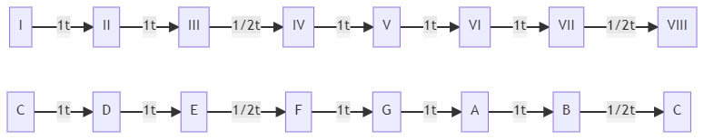

## Tonalidad mayor

### La escala mayor

La escala mayor está compuesta por 7 notas. La distancia entre cada una de estas notas es de 1 tono, excepto entre los grados III y IV, y V y VI, que es de 1 semitono.

La forma más clara de visualizar estos intervalos es con la escala de **Do mayor**:

    

#### Ejercicios

Se pide construir las siguientes escalas mayores (pulsar sobre la flecha para ver la solución):

    

        Re Mayor
    

    Re Mi Fa# Sol La Si Do# Re

    

        Mib Mayor
    

    Mib Fa Sol Lab Sib Do Re Mib

    

        La Mayor
    

    La Si Do# Re Mi Fa# Sol# La

### Truco: Orden de las alteraciones

Siempre que una tonalidad tenga una cierta alteración, deberá aparecer una serie de alteraciones dada por la siguiente tabla y siempre en ese mismo orden:

| Alteración 	|        1       	|        2       	|        3        	|        4       	|        5        	|        6       	|        7       	|
|:----------:	|:--------------:	|:--------------:	|:---------------:	|:--------------:	|:---------------:	|:--------------:	|:--------------:	|
|      #     	| Fa# 	| Do# 	| Sol# 	| Re# 	|  La# 	| Mi# 	| Si# 	|
|      b     	| Sib 	| Mib 	|  Lab 	| Reb 	| Solb 	| Dob 	| Fab 	|

Por ejemplo, si una tonalidad tiene un La#, deberá tener también un Fa#, Do#, Sol# y Re#. Por otro lado, si tuviera un Lab, deberá tener un Sib y un Mib.

Es importante tener esta tabla en mente para poder crear escalas con mayor rapidez.

### Truco: tonalidad

A partir de la anterior tabla se pueden definir dos trucos para encontrar la tonalidad y las alteraciones de una escala.

#### Sostenidos

1. Dadas las alteraciones, al último sostenido (#) se le sube un semitono y nos da la tonalidad.
2. Dada la tonalidad, se le baja un semitono y nos da el último #.

#### Bemoles

1. Dadas las alteraciones, el penúltimo bemol (*b*) nos da la tonalidad.
2. Si el último bemol es Sib la tonalidad es FaM.