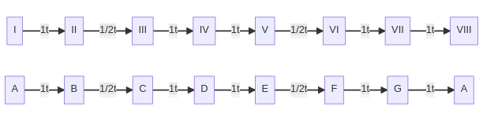

## Tonalidad menor

### La escala menor

La escala mayor está compuesta por 7 notas. La distancia entre cada una de estas notas es de 1 tono, excepto entre los grados II y III, y V y VI, que es de 1 semitono.

La forma más clara de visualizar estos intervalos es con la escala de **La menor**, que no tiene alteraciones:

    

### Truco: el relativo menor

Por construcción, la escala menor surge de la escala de Do mayor, salvo porque se empieza en La. Esto hace que todas las tonalidades menores sean relativo menor de una tonalidad mayor y compartan alteraciones. Para encontrar esta tonalidad mayor se busca la tercera menor descendente. Es decir, partiendo de la tonalidad mayor, se resta un tono y medio y ese será su relativo menor.

Por ejemplo, el relativo menor de DoM es Lam. Por lo tanto, la escala de Lam tendrá las mismas alteraciones que DoM, es decir, ninguna.

#### Ejercicios

Se pide construir las siguientes escalas menores (pulsar sobre la flecha para ver la solución):

    

        Do menor
    

    

        Lo primero es ver de qué tonalidad mayor es relativo menor Dom. O lo que es lo mismo, encontrar la nota cuya tercera descendente sea Do. En este caso esa nota es Mib. 
    

    

        <b>Importante</b>: podría parecer que la tercera descente es Re# ya que difiere en 1 tono y medio de Do. Sin embargo, el Re es una segunda de Do y lo que se busca es la tercera.
    

    

        Por lo tanto, la tonalidad de Dom tendrá las mismas alteraciones que MibM. Siguiendo el truco de la <a href="major.html">sección de escalas mayores</a>, el penúltimo bemol da la tonalidad (Mib). Por lo tanto el último bemol sería Lab y todas las alteraciones Sib, Mib y Lab.
    

    

        Fa#m
    

    

        Lo primero es ver de qué tonalidad mayor es relativo menor Fa#m. O lo que es lo mismo, encontrar la nota cuya tercera descendente sea Fa#. En este caso esa nota es La. 
    

    

        Siguiendo el truco de la <a href="major.html">sección de escalas mayores</a>, bajando un semitono a la tonalidad (La) tenemos que el último sostenido es Sol#. Por lo tanto las alteraciones de la tonalidad de Fa#m serán Fa#, Do# y Sol#.
    

### Otras escalas menores

1. **Escala menor armónica:** se altera el 7° grado un semitono de forma ascendente.
2. **Escala menor dórica:** se altera el 6° grado un semitono de forma ascendente.
3. **Escala menor melódica:** se alteran el 6° y 7° grado un semitono de forma ascendente.